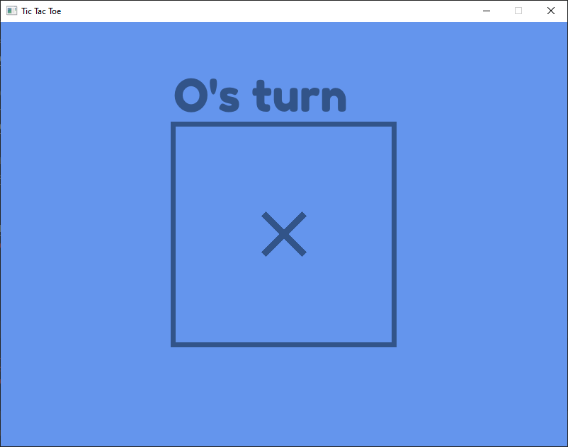

# A bad implementation of Tic Tac Toe made in Rust :)

Made with [tetra](https://tetra.seventeencups.net/). If you want to build it yourself, you'll need SDL 2. Tetra  installation instructions are available [here](https://tetra.seventeencups.net/installation).

